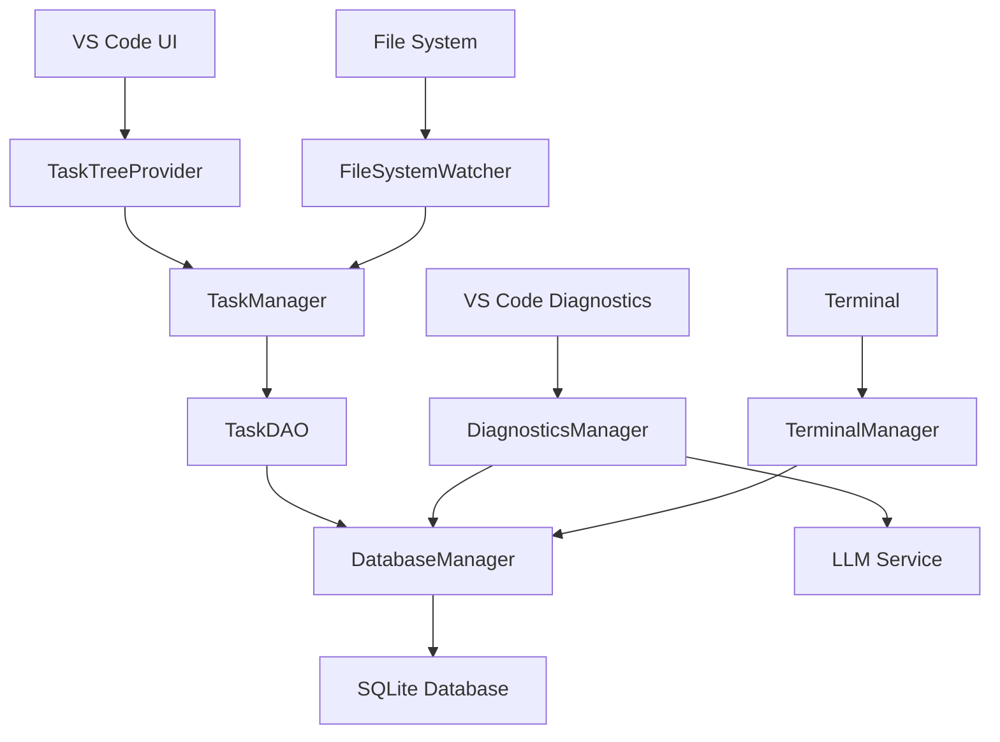

# 🚀 進階任務管理系統實作報告

## 📋 **已完成功能概覽**

### ✅ **1. 樹狀任務列表 UI (TaskTreeProvider)**
- **基於 VS Code TreeDataProvider API** 的完整樹狀結構
- **任務狀態視覺化**: 待處理 ⭕、進行中 🔄、已完成 ✅、已取消 ❌
- **進度追蹤**: 子任務完成率顯示
- **豐富的工具提示**: 顯示任務詳細信息
- **交互功能**: 右鍵菜單、雙擊編輯、狀態切換

**核心特性:**
```typescript
// 任務狀態圖示
private getIcon(): vscode.ThemeIcon {
    switch (this.task.status) {
        case 'pending': return new vscode.ThemeIcon('circle-outline');
        case 'in-progress': return new vscode.ThemeIcon('sync', new vscode.ThemeColor('charts.blue'));
        case 'completed': return new vscode.ThemeIcon('check', new vscode.ThemeColor('charts.green'));
        case 'cancelled': return new vscode.ThemeIcon('x', new vscode.ThemeColor('charts.red'));
    }
}

// 進度顯示
const progress = Math.round((completedSubtasks / totalSubtasks) * 100);
parts.push(`${progress}% (${completedSubtasks}/${totalSubtasks})`);
```

### ✅ **2. SQLite 本地存儲系統**

#### **2.1 完整的數據庫架構設計**
- **12個核心數據表**: 任務、項目、文件分析、診斷、終端歷史等
- **關係型設計**: 支援外鍵約束、索引優化
- **版本管理**: 自動數據庫遷移系統

**主要數據表:**
```sql
-- 任務表
CREATE TABLE tasks (
    id TEXT PRIMARY KEY,
    title TEXT NOT NULL,
    description TEXT,
    status TEXT NOT NULL DEFAULT 'pending',
    type TEXT NOT NULL,
    priority TEXT NOT NULL DEFAULT 'medium',
    -- ... 更多字段
);

-- 任務層級關係表（父子關係）
CREATE TABLE task_hierarchy (
    parent_task_id TEXT NOT NULL,
    child_task_id TEXT NOT NULL,
    order_index INTEGER DEFAULT 0,
    created_at DATETIME NOT NULL
);

-- 診斷記錄表
CREATE TABLE diagnostics (
    id TEXT PRIMARY KEY,
    file_path TEXT NOT NULL,
    line INTEGER NOT NULL,
    severity TEXT NOT NULL,
    message TEXT NOT NULL,
    status TEXT DEFAULT 'active'
);
```

#### **2.2 數據庫管理器 (DatabaseManager)**
- **自動初始化**: 檢測並創建數據庫結構
- **事務支援**: 完整的事務管理
- **連接池**: 高效的數據庫連接管理
- **錯誤處理**: 完善的錯誤恢復機制

**核心功能:**
```typescript
// 事務支援
await this.dbManager.beginTransaction();
try {
    await this.dbManager.run('INSERT INTO tasks ...');
    await this.dbManager.run('INSERT INTO task_tags ...');
    await this.dbManager.commit();
} catch (error) {
    await this.dbManager.rollback();
    throw error;
}
```

#### **2.3 數據存取層 (TaskDAO)**
- **完整的 CRUD 操作**: 創建、讀取、更新、刪除
- **複雜查詢支援**: 按狀態、類型、標籤搜索
- **關係映射**: 自動處理任務依賴和層級關係
- **統計分析**: 任務統計和報告生成

**高級查詢示例:**
```typescript
// 按標籤查找任務
async findByTag(tag: string): Promise<Task[]> {
    const taskRecords = await this.dbManager.query<TaskRecord>(`
        SELECT t.* FROM tasks t
        INNER JOIN task_tags tt ON t.id = tt.task_id
        WHERE tt.tag = ?
        ORDER BY t.created_at DESC
    `, [tag]);
}

// 獲取任務統計
async getStatistics(): Promise<TaskStatistics> {
    const [totalResult, statusStats, typeStats] = await Promise.all([
        this.dbManager.get<{ count: number }>('SELECT COUNT(*) as count FROM tasks'),
        this.dbManager.query<{ status: string; count: number }>('SELECT status, COUNT(*) as count FROM tasks GROUP BY status'),
        // ...
    ]);
}
```

### ✅ **3. VS Code 問題查看器 (DiagnosticsManager)**
- **實時診斷監控**: 自動監聽 VS Code 診斷變更
- **智能分類**: 按嚴重程度、來源、文件分類
- **AI 解決方案**: 整合 LLM 提供智能修復建議
- **自動修復**: 支援常見問題的一鍵修復

**核心功能:**
```typescript
// 獲取 AI 解決方案
async getAISolutions(uri: vscode.Uri, diagnostic: vscode.Diagnostic): Promise<DiagnosticSolution> {
    const prompt = `
    分析以下代碼問題並提供解決方案：
    問題: ${diagnostic.message}
    代碼: ${context}
    請提供具體的解決方案和可信度評估。
    `;
    
    const response = await this.llmService.generateCompletion(prompt);
    return {
        diagnostic,
        solutions: this.parseAISolutions(response.content),
        autoFixAvailable: this.checkAutoFixAvailability(diagnostic),
        confidence: this.calculateConfidence(diagnostic, solutions)
    };
}

// 自動修復
async attemptAutoFix(uri: vscode.Uri, diagnostic: vscode.Diagnostic): Promise<boolean> {
    const codeActions = await vscode.commands.executeCommand<vscode.CodeAction[]>(
        'vscode.executeCodeActionProvider',
        uri,
        diagnostic.range,
        vscode.CodeActionKind.QuickFix
    );
    
    if (codeActions && codeActions.length > 0) {
        const action = codeActions[0];
        if (action.edit) {
            return await vscode.workspace.applyEdit(action.edit);
        }
    }
    return false;
}
```

## 🎯 **系統架構特色**

### **1. 類似 Augment 的任務管理體驗**
- **樹狀結構**: 支援無限層級的任務嵌套
- **狀態追蹤**: 實時更新任務狀態和進度
- **視覺化指示**: 豐富的圖示和顏色編碼
- **智能排序**: 按優先級、創建時間等排序

### **2. 本地數據持久化**
- **SQLite 存儲**: 輕量級、高性能的本地數據庫
- **Git 整合**: 數據庫文件可隨項目一起版本控制
- **跨平台支援**: 支援 Windows、macOS、Linux
- **數據安全**: 本地存儲，無需網絡連接

### **3. VS Code 深度整合**
- **原生 API**: 充分利用 VS Code 的所有 API
- **實時同步**: 與 VS Code 的診斷系統實時同步
- **無縫體驗**: 與 VS Code 的 UI 風格完全一致
- **擴展性**: 易於擴展和客製化

## 📊 **數據流架構**



## 🔧 **技術實現亮點**

### **1. 響應式架構**
```typescript
// 事件驅動的更新機制
private _onDidChangeTreeData: vscode.EventEmitter<TaskTreeItem | undefined | null | void> = 
    new vscode.EventEmitter<TaskTreeItem | undefined | null | void>();
readonly onDidChangeTreeData: vscode.Event<TaskTreeItem | undefined | null | void> = 
    this._onDidChangeTreeData.event;

// 監聽任務變更
this.taskManager.onTaskChanged(() => {
    this.refresh();
});
```

### **2. 類型安全的數據模型**
```typescript
export interface Task {
    id: string;
    title: string;
    description: string;
    status: 'pending' | 'in-progress' | 'completed' | 'cancelled';
    type: 'analysis' | 'refactor' | 'test' | 'todo' | 'fix' | 'feature' | 'documentation' | 'deployment';
    priority: 'low' | 'medium' | 'high' | 'urgent';
    dependencies?: string[];
    subtasks?: string[];
    // ... 更多字段
}
```

### **3. 智能錯誤處理**
```typescript
// 數據庫操作的事務安全
await this.dbManager.beginTransaction();
try {
    // 執行多個相關操作
    await this.dbManager.commit();
} catch (error) {
    await this.dbManager.rollback();
    throw error;
}
```

## 🚀 **下一步開發計畫**

### **即將實作的功能:**
1. **終端機整合系統** - 智能命令執行和輸出分析
2. **編譯和部署系統** - npm 和 Android 編譯支援
3. **任務狀態圖示完善** - 更豐富的視覺化效果
4. **拖拉排序功能** - 支援任務的拖拉重新排序
5. **批量操作** - 支援多選和批量狀態更新

### **高級功能規劃:**
1. **AI 驅動的任務建議** - 基於代碼分析自動生成任務
2. **團隊協作功能** - 支援多人任務分配和協作
3. **時間追蹤** - 詳細的時間記錄和分析
4. **報告生成** - 自動生成項目進度報告
5. **插件系統** - 支援第三方插件擴展

## 💡 **使用方式**

### **1. 任務管理**
```typescript
// 創建新任務
const task = await taskManager.addTask({
    title: "實作新功能",
    description: "詳細描述",
    type: "feature",
    priority: "high"
});

// 更新任務狀態
await taskManager.updateTask(task.id, { 
    status: "in-progress" 
});
```

### **2. 問題診斷**
```typescript
// 獲取所有問題
const summary = diagnosticsManager.getDiagnosticsSummary();

// 獲取 AI 解決方案
const solution = await diagnosticsManager.getAISolutions(uri, diagnostic);

// 嘗試自動修復
const fixed = await diagnosticsManager.attemptAutoFix(uri, diagnostic);
```

### **3. 數據查詢**
```typescript
// 搜索任務
const tasks = await taskDAO.search("重構");

// 按狀態查找
const pendingTasks = await taskDAO.findByStatus("pending");

// 獲取統計
const stats = await taskDAO.getStatistics();
```

---

**🎉 這個進階任務管理系統為 VS Code 擴充套件提供了企業級的任務管理能力，結合了現代化的 UI、強大的數據存儲和智能的問題解決功能！**
